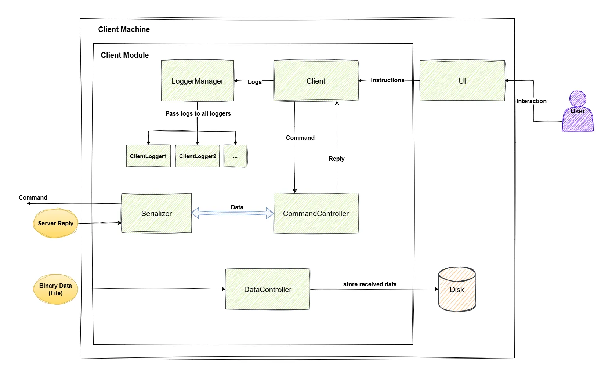

The **Client** Module is responsible for command execution and communication with the **Server**.
It handles user inputs, serializes commands, processes server replies, and manages local data storage and logging.

**Lets Explain the above diagram in depth.**

### UI 
> The **UI** is refering to any type of control interface which is handled by the user or even automated by another software.

### Client 
> The `Client` is the root controller which abstracts all the functionalities of the module. It makes it easy for any software to integrate it. For example those functionalities include Sending a Command, Specifing the client IP and username, Specifing Remote host and so on..

### LoggerManager
> The `LogggerManager` is an important module as it is responsible for all types of logs which are being recorded by the whole running Client Module. This module allows us not just to have one logger but also to add many loggers which operate at the same time. For example we could have 2 loggers: one for the CLI to help a user see what is happening and the other is writing into some file on the disk for later debugging or tracing.

### CommandController
> This controller acts as the Central coordinator for commands processing. it is responsible for sending and receiving commands from the **Remote Server**. 

### DataController
> Just like the `CommandController`, the `DataController` is responsible for file receive and sending. 

### Serializer 
> The `Serializer` is used to transfer objects on the network so that it can be translated properly in the server side. you can read about this concept on <a href="https://en.wikipedia.org/wiki/Serialization" target="_blank">wikipedia</a> to have an idea on how it works.
